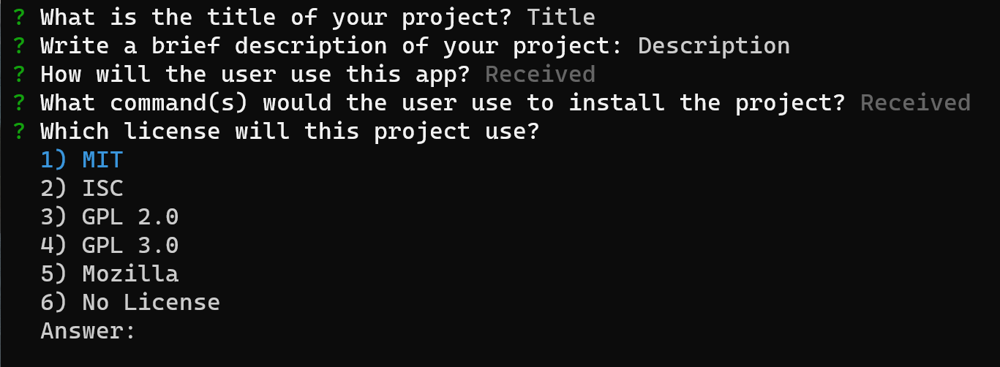
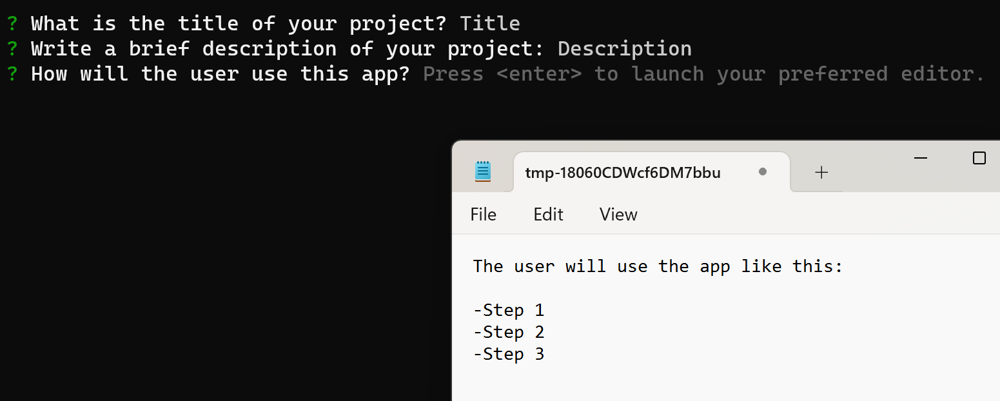

# README_Please

[](https://opensource.org/licenses/MIT)

Have a hard time thinking of how to setup your readme? Are you not familiar with the markdown syntax and wished there was a way to quickly generate a high quality README within minutes? Well look no further!!! README_Please is a node.js package that generates a high quality based on user input. No more stressing about creating your README file. Just start this package and enjoy the template!

## Table of Contents
- [Installation](#installation)
- [Usage](#usage)
- [Preview](#usage)
- [Questions](#questions)
- [License](#license)

## Installation

> **_NOTE:_**
> This package assumes you already have Node.js and npm installed. If you don't, [download Node.js](https://nodejs.org/en/download) first then come back to these installation steps.

1. Open your terminal and clone the github repo:

```
git clone https://github.com/hokage-216/readme-please.git
```

2. 'cd' into the folder:

```
cd readme-please
```

3. Then install the required packages:

```
npm install
```

## Usage

After installing required packages, you are able to run:

```
npm start
```

The program will begin allowing you to answer each prompt accordingly.



Some prompts will open a editor, allowing for more dynamic input:



> **_NOTE:_**
> If you are using windows. The default editor is Notepad. However you can change this if you wish. Be sure to save the temporary file before exiting the window to save your input.

## Preview

Click the image below to view a live demonstation.

[](https://youtu.be/2Emdx1P5SNc)

## Questions

If you have any questions about the repo, open an issue or contact me directly at berrylevente@hotmail.com.

To view more of my work [click here](https://github.com/hokage-216/).

## License

Copyright (c) 2024 LeVente Berry Jr.

Licensed under the MIT license. To view the license terms [click here](https://opensource.org/licenses/MIT).
